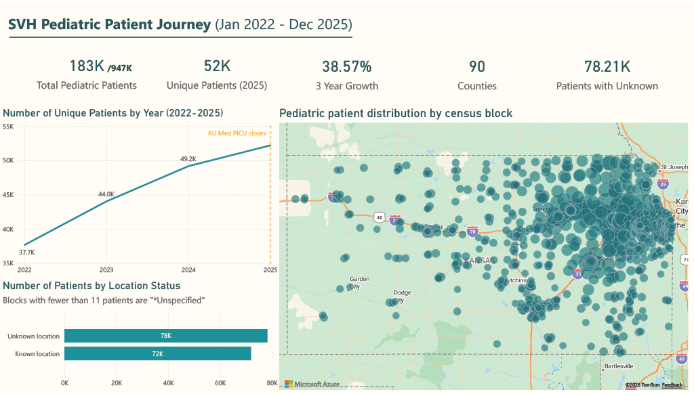

# Navigating Accessible Care
### ASA DataFest 2026 — Stormont Vail Health | Team Double A | Knox College
**🏅 Honorable Mention**
 
---
 
## Overview
 
This project was completed as part of ASA DataFest 2026, a 48-hour competitive data analysis event. Our team analyzed four years of patient encounter data from **Stormont Vail Health (SVH)**, a nonprofit integrated health system serving northeast Kansas, to uncover barriers to accessible care.
 
Our central question: **Is SVH reaching the patients who need it most?**
 
The team split into two angles:
- **Transportation barriers** (teammate) — measurable impact on ED dependency and patient outcomes across all age groups
- **Pediatric geographic reach** (my focus) — who SVH's pediatric patients are, where they come from, and how many the system can't locate at all
---
 
## My contribution — The invisible patient
 
### The finding
 
SVH served **52,185 unique pediatric patients in 2025**, a 38.6% increase from 37,659 in 2022, drawing from **90 counties** across Kansas, far exceeding their stated 19-county service area. Yet **47.9% of those patients have no recorded census block location**. These are rural families in towns too small to appear in US Census data: the hardest to reach and the least visible to the system meant to serve them.
 
During competition week, KU Med announced it was closing its PICU, making SVH the only pediatric intensive care option for critically ill children across northeast Kansas. Our data showed SVH's pediatric patient base was already growing rapidly before that closure, and that nearly half of those patients couldn't be found geographically.
 
### The dashboard
 
An interactive Power BI dashboard visualizing SVH's pediatric patient geography across Kansas, including:
 
- **Census block bubble map** — patient density by geographic block, sized by patient count, revealing the concentration around Topeka and the corridor cities (Lawrence, Junction City, Emporia, Manhattan) alongside the blank rural areas representing the invisible 47.9%
- **Year-over-year growth chart** — unique pediatric patients 2022–2025, annotated with the KU Med PICU closure
- **Location status bar chart** — known vs unknown patient location, with a transport flag slicer showing how the invisible population skews toward families with transportation barriers
- **KPI cards** — unique patients (2025), 3-year growth, counties represented, unknown location rate

 
### Key numbers
 
| Metric | Value |
|---|---|
| Unique pediatric patients (2025) | 52,185 |
| 3-year growth | +38.6% |
| Counties represented in data | 90 |
| Stated SVH service area | 19 counties |
| Patients with no recorded location | 47.9% |
| Pediatric patients flagged for transport need | 217 |
| After-hours rate (transport-flagged) | 41.5% vs 30.5% |
 
---
 
## Data
 
Data was provided by Stormont Vail Health via the ASA DataFest program and is **not included in this repository** per DataFest data use agreements. The dataset covered January 2022 – December 2025 and consisted of seven linked files:
 
| File | Rows |
|---|---|
| `encounters.csv` — patient–provider encounters | 8.1M |
| `patients.csv` — demographics and geography | 947K |
| `diagnosis.csv` — ICD-10 codes and groupings | 1.5M |
| `departments.csv` — SVH locations and specialties | 11.6K |
| `providers.csv` — provider information | 299K |
| `social_determinants.csv` — SDOH survey responses | 3.97M |
| `tigercensuscodes.csv` — US Census block geographic data | 2.4K |
 
---
 
## Methods
 
### Pediatric patient identification
Pediatric patients were identified using `PatientBirthYearBin >= 2005`, capturing patients who were under 18 at some point during the 2022–2025 data window. This produced 150,100 unique pediatric patients.
 
### Geographic analysis
Patient locations were mapped using `CensusBlockGroupFipsCode` joined to the `tigercensuscodes` file via `GEOID`, which provided centroid latitude and longitude (`CENTLAT`, `CENTLON`) for each census block. Blocks with fewer than 11 patients are suppressed in the source data per US Census privacy regulations — this suppression disproportionately affects rural areas, making the 47.9% unknown location figure both a data limitation and the central story point.
 
County was extracted from the first five digits of the FIPS code (state + county), revealing that SVH draws patients from 90 distinct counties — far beyond the stated 19-county service area.
 
### Transportation flag
Patients were flagged for transportation need based on "Yes" responses to the Transportation Needs domain of the SDOH survey. 217 unique pediatric patients were flagged, and their encounter patterns (after-hours rate, ED rate) were compared against non-flagged patients.
 
### Tools
Python (`pandas`, `numpy`) for data wrangling and export. Power BI for interactive dashboard.
 
---
 
## Recommendations
 
1. **Fix address collection at registration**: 47.9% of pediatric patients have no recorded location. SVH cannot do geographic outreach or transportation planning for families it cannot locate. Making address collection mandatory at intake is a zero-cost, immediate fix.
2. **Plan capacity for the real footprint**: SVH believes it serves 19 counties. The data shows 90. Capacity planning — staffing, clinic hours, PICU beds — should reflect the actual geographic reach, especially as the KU Med closure expands demand eastward toward Lawrence and the KC corridor.
3. **Invest in corridor outreach now**: Extended clinic hours, telehealth triage, and mobile outreach targeted at the corridor cities (Lawrence, Junction City, Emporia) and the rural census blocks that are on the map but underserved, before they become the blocks that disappear entirely.
---
 
## Results
 
**🏅 Honorable Mention — ASA DataFest 2026, Knox College**
 
---
 
## Team
 
**Team Double A — Knox College**
- Anh Phan
- Akbota Serikkyzy
---
 
## Notes
 
- Raw data is not included per ASA DataFest data use agreements
- No patient data was uploaded to any AI model during this project per DataFest AI use guidelines
- AI tools (Claude, Microsoft Copilot) were used for coding assistance and analytical brainstorming only; all analytical decisions and interpretations are our own